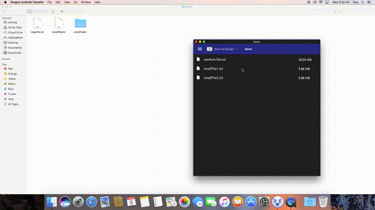

# Dragon Android Transfer

A macOS utility application for transferring files with an Android device. 
[App installation & how to use it.](http://kishanprao.herokuapp.com/products/dragon-android-transfer)

## Features:
- It currently supports copy & paste operations, deletion of files, new folder creation, device information.
- Once the initial setup is finished, it works on plug and play basis.
- Operates using drag & drop of files or through global keyboard shortcuts.
- Supports choosing Dark and Light theme.

## Demo

## Version 1
The application used `adb` program to access the Android device's file content. 
Shell commands are invoked on the device, the results of the commands are parsed and appropriate action is undertaken. 
USB Debugging must be enabled for this method. 
Using adb (an executable) was not approved by Apple's App Store guidelines. 

The dev stack used was `C++, Objective C, Objective C++, Swift and Bash`. 
Command design pattern was used for the various commands (list, file size, space available, etc) invoked through adb. 
The shell outputs are parsed differently based on type of Linux kernel used; GNU, Solaris or BSD. 
Bezier curves are used for smoother animations. 
Icons were either created by me using Photoshop or used from [Google's Material icons](https://material.io/resources/icons).

## Current Development
(Not updated since 2019) 
An alternative solution was to make use of a wireless, socket communication. 
A complementary Android application was developed in Kotlin. 
The `socket protocol` consisted of:
- Fixed packet size with message status.
- State machine model on both platforms.
- Separate threads for read and write, message handling through queues.
- Concurrency through synchronized blocks & atomic references.
 

The wireless module hasn't been completely tested & integrated yet.

## Credits
[MASShortcut by Vadim Shpakovski](https://github.com/shpakovski/MASShortcut), used for global keyboard shortcuts in macOS.